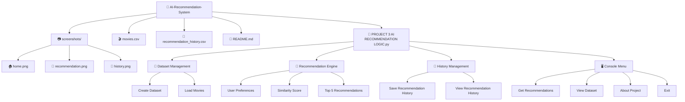
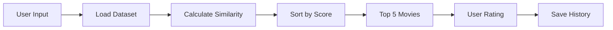

# AI-Recommendation-Logic
# 🎬 AI Movie Recommendation System 

<p align="center">
  
  
  
  
  
</p>

<p align="center">
An intelligent movie recommendation system built using <b>Python</b> that recommends movies based on
<b>Genre, Language, Mood, and IMDb Rating</b> using a rule-based AI similarity matching algorithm.
</p>

---

# 📖 Overview

Finding the perfect movie can be difficult.

This project implements a simple **Artificial Intelligence Recommendation System** that understands a user's preferences and recommends the most suitable movies using a similarity scoring algorithm.

The system also stores recommendation history and allows users to rate the recommended movies.

---

# ✨ Features

✅ Rule-Based AI Recommendation Logic

✅ Similarity Score Calculation

✅ Personalized Movie Suggestions

✅ Top 5 AI Recommendations

✅ Movie Dataset using CSV

✅ Recommendation History

✅ User Rating System

✅ Error Handling

✅ Interactive Console Interface

✅ Clean and Modular Python Code

---

# 🧠 AI Recommendation Logic

The recommendation score is calculated using four user preferences.

| Preference | Score |
|------------|-------|
| Genre Match | +40 |
| Language Match | +25 |
| Mood Match | +20 |
| IMDb Rating Match | +15 |

Maximum Similarity Score

```text
40 + 25 + 20 + 15 = 💯 100%
```

Movies with higher similarity scores are ranked first.

---

## 📂 Project Structure



# 🎥 Sample Dataset

| Movie | Genre | Language | Mood | IMDb |
|--------|--------|-----------|------|------|
| Inception | Sci-Fi | English | Exciting | ⭐ 8.8 |
| Interstellar | Sci-Fi | English | Inspirational | ⭐ 8.7 |
| Titanic | Romance | English | Emotional | ⭐ 7.8 |
| Dangal | Sports | Hindi | Motivational | ⭐ 8.5 |
| Avengers Endgame | Action | English | Exciting | ⭐ 8.4 |
| Coco | Animation | English | Emotional | ⭐ 8.4 |

---

# ⚙️ How It Works

```
User Input
     │
     ▼
Enter Preferences
     │
     ▼
Load Dataset
     │
     ▼
Calculate Similarity Score
     │
     ▼
Sort Movies
     │
     ▼
Top 5 Recommendations
     │
     ▼
User Rating
     │
     ▼
Save Recommendation History
```

---

# 🚀 Installation

## 1️⃣ Clone the Repository

```bash
git clone https://github.com/vaishnavibansal222-ctrl/AI-Recommendation-System.git
```

## 2️⃣ Navigate to the Project Directory

```bash
cd AI-Recommendation-System
```
## 3️⃣ Run the Application

```bash
python "PROJECT 3 AI RECOMMENDATION LOGIC.py"
```

# 🖥️ Application Menu

```
1. Get Recommendations

2. View Dataset

3. Recommendation History

4. About Project

5. Exit
```

---

# 🎯 Example

### User Preferences

```
Genre      : Action

Language   : English

Mood        : Exciting

Minimum Rating : 8
```

### AI Output

```
1. Avengers Endgame
Similarity : 100%

2. Spider-Man No Way Home
Similarity : 100%

3. The Dark Knight
Similarity : 80%

4. Doctor Strange
Similarity : 65%

5. Avatar
Similarity : 55%
```

---

# 📊 Recommendation Process



---

# 🛠️ Technologies Used

- 🐍 Python 3
- 📄 CSV
- 📅 Datetime Module
- 📂 OS Module
- 🤖 Rule-Based AI
- 📊 Similarity Matching Algorithm

---

# 📈 Future Improvements

- Machine Learning Recommendation Engine

- Collaborative Filtering

- Content-Based Recommendation

- Hybrid Recommendation System

- Movie Posters

- GUI using Tkinter

- Streamlit Web App

- Flask API

- Database Integration (SQLite/MySQL)

- User Login System

---

# 📷 Screenshots


# RECOMMENDATION 


# RECOMMDNDATION HISTORY 


# 🌟 Highlights

- Beginner Friendly
- Modular Code
- AI-Based Logic
- Real Dataset
- Easy to Customize
- Good for College Projects
- Internship Ready

---

# 👩‍💻 Developer

**Bhaumik Bisht**

🎓 DecodeLabs Artificial Intelligence Internship

🤖 AI & Machine Learning Enthusiast


# 📜 License

This project is created under MIT licence

---

# ⭐ Support

If you found this project useful,

⭐ Star this repository

🍴 Fork it

📢 Share it with others

---

<p align="center">

## ⭐ "Artificial Intelligence is not replacing humans, it is empowering them."

</p>
